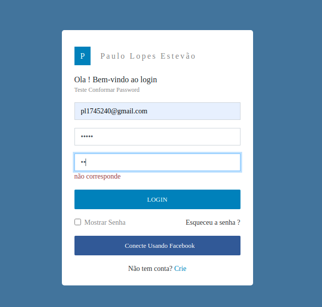
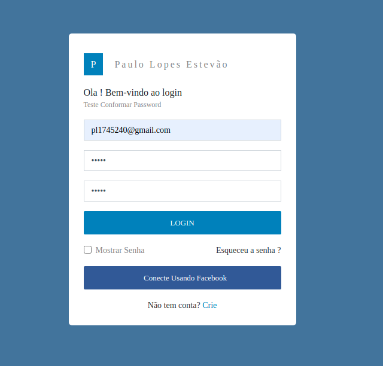

# JavaScript

> *Fazer confirmação de password*

# Faça o teste aqui -> [Clica aqui](https://paulo-lopes-estevao.github.io/Javascript_confirm-password/)

#### Trago um *algoritmo de busca* que faz de forma rápida confirmação de password

``` JS
// JavaScript

function ConfirmPassword() {

    id_confirm = document.getElementById("confirm").value
    id_senha = document.getElementById("senha").value

    let senha = [{ passe: id_senha }]

    var confirm = senha.filter(function(value){

        return value.passe.includes(id_confirm)
    
    })
    
    confirm.length == 0 ? console.log("False") : console.log("True")

}

```

## Confirmação não corresponde a password



## Confirmação corresponde a password




</br>
<hr>

# Faça o teste aqui -> [Clica aqui](https://paulo-lopes-estevao.github.io/Javascript_confirm-password/)


<button style="background-color:green;border-radius:0.4rem">
<a href="https://github.com/Paulo-Lopes-Estevao?tab=repositories" style="color:black;"> Ver mais </a>
</button>